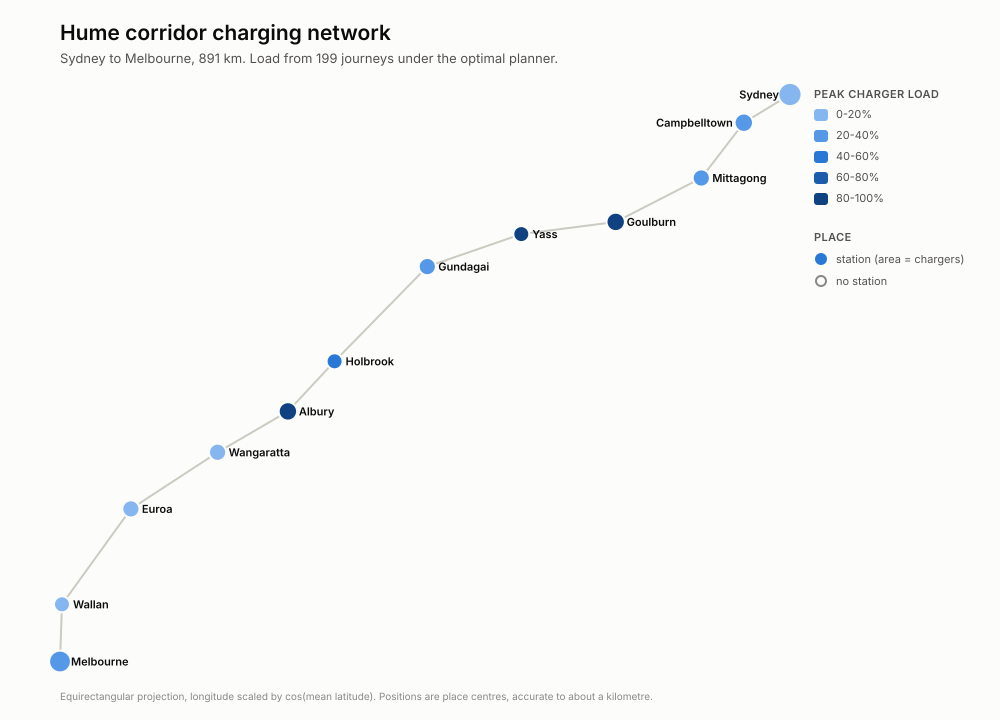

# EV Network Toolkit

Where should electric vehicles charge, and where should the next charging station
go — when the answer depends not just on distance and price, but on how many
other vehicles had the same idea?

This is a C++17 engine for **routing agents across a network where they compete
for limited capacity at nodes, trading money against time.** EV charging is the
first case study; the core is domain-agnostic by design (see
[Beyond EVs](#beyond-evs)).

```
$ evnet compare --network data/hume --demands data/hume/demands.csv

Fleet of 199 over data/hume, event-driven, time valued at $20.00/h

planner        completed  stranded      mean $   mean wait   p95 wait   max wait   mean gen $   stops    elapsed  peak Q    util  busiest
--------------------------------------------------------------------------------------------------------------------------------
farthest             199         0     $174.73       0.79h      3.46h      3.88h      $331.66    0.90      7.85h      19     53%  Yass
cheapest             199         0     $172.89       0.02h      0.12h      0.26h      $319.77    3.63      7.34h       3     21%  Yass
min-wait             199         0     $172.85       0.00h      0.00h      0.48h      $317.75    2.76      7.24h       2     19%  Yass
generalised          199         0     $172.89       0.02h      0.12h      0.26h      $319.77    3.63      7.34h       3     21%  Yass
optimal              199         0     $173.56       0.02h      0.16h      0.43h      $316.26    1.28      7.14h       3     34%  Albury
```

That table is the point of the project. Five strategies, one feasibility model, and
a genuine disagreement about what "best" means.

<picture>
  <source media="(prefers-color-scheme: dark)" srcset="docs/hume-map-dark.svg">
  
</picture>

And this is why it is worth having a map as well as a table. Load concentrates in the
middle of the corridor, not at the ends where the hardware is.

---

## Why this exists

This toolkit is the merge of two university projects that solved adjacent halves
of one problem and could not talk to each other:

|  | Sydney metro study | Hume corridor study |
|---|---|---|
| Network | 24 suburbs, arbitrary graph | 12 towns in a straight chain |
| Question | *Where* should I charge? | *When* should I stop? |
| Method | Dijkstra + facility location | Greedy scan + queueing |
| Scarce resource | Price per kWh | Charger availability |
| Units | kWh and dollars | km of range and hours |
| Interaction | none — vehicles independent | vehicles affect each other |

Neither could express the other's concern. The metro study would route a vehicle
to the cheapest charger with no idea whether there would be a two-hour queue on
arrival; the corridor study balanced queues while knowing nothing about price.

Merging them was not a matter of copying files together. It required:

- **One conversion constant.** Range (km) and energy (kWh) reconcile through
  consumption per distance, 18 kWh/100 km. That single factor is the pivot the
  whole merge turns on — see [`units.hpp`](include/evnet/units.hpp).
- **Throwing away the corridor representation.** A chain is a graph whose
  interior nodes have two neighbours, so the graph model subsumes it and the
  corridor's bespoke prefix-sum distance code disappears. `ChargingStation`,
  `Constant.h`'s parallel arrays and `distanceToSydney` all went with it.
- **Rewriting reachability.** Both `farthestCity()` and
  `calculateFarthestCity()` were near-duplicate prefix sums, correct only on a
  chain. On a graph, "where can I get with this much charge" is a range-limited
  Dijkstra: [`Router::reachableWithin`](include/evnet/router.hpp).
- **One demand type for two questions.** A round-trip top-up (`requiredKwh > 0`,
  origin == destination) and a journey (`requiredKwh == 0`) are now the same
  struct down one code path.
- **One objective.** `generalised cost = travel + energy + (wait + charge + driving)
  × value_of_time`. Set the value of time to zero and it reduces to the metro
  study's objective; set it very high and it reduces to the corridor study's.
  (Driving time joined the sum in stage 2, once there was a clock to measure it.)

Both original algorithms survive as **policies**, not as one superseding the
other — because the comparison is the deliverable.

## What it does

```bash
evnet inspect  --network data/sydney                                  # summarise + validate
evnet route    --network data/hume --from Sydney --to Melbourne \
               --battery 67 --soc 56 --planner optimal                # one vehicle's plan
evnet compare  --network data/hume --demands data/hume/demands.csv    # all planners, tabulated
evnet compare  --network data/hume --demands data/hume/demands.csv \
               --engine static                                        # stage 1's timeless model
evnet simulate --network data/hume --demands data/hume/demands.csv \
               --planner optimal --timeseries load.csv --trips trips.csv
evnet site     --network data/sydney --demands data/sydney/demands.csv --top 5

python3 tools/saturation_sweep.py                                     # where congestion bites
```

Add `--format csv` to `compare` for machine-readable output, which is how the
analysis in `tools/` drives the engine.

### Planners

| Name | Optimises | Origin |
|---|---|---|
| `farthest` | progress per stop | the naive baseline, found commented out in the corridor project |
| `cheapest` | travel + energy cost | the Sydney metro algorithm |
| `min-wait` | expected queue time | the Hume corridor algorithm |
| `generalised` | money + time × value-of-time | the merged objective |
| `optimal` | least generalised cost over the whole journey | stage 2; Dijkstra over `(node, charge)` state |

The first four are greedy: they score only the next stop. `optimal` searches the
joint routing-and-charging problem, which is what Finding 3 is about.

## Findings

### 1. The static congestion model overstated waits by up to 1,500x

Stage 1 counted arrivals at each station and never let them depart, so its "queue"
was cumulative arrivals and its waits were an index rather than a duration. Running
the identical fleet through the event-driven clock, where chargers free up:

| planner | static mean wait | measured | ratio | static p95 | measured | ratio |
|---|---|---|---|---|---|---|
| `farthest` | 4.77h | 0.79h | 6x | 18.00h | 3.46h | 5x |
| `cheapest` | 17.67h | 0.02h | **1,133x** | 59.35h | 0.12h | **515x** |
| `min-wait` | 5.46h | 0.00h | 1,476x | 17.75h | 0.00h | >1,000x |
| `generalised` | 15.53h | 0.02h | 996x | 50.24h | 0.12h | 436x |

Reproduce with `--engine static` versus `--engine events`.

The uncomfortable corollary: **at its inherited fleet size the Hume corridor is
barely congested at all.** 199 vehicles over a 16-hour day against 48 chargers is
roughly 20-30% utilisation. So the legacy corridor project's central claim -- that
queue balancing matters -- was substantially an artefact of a queue that never
emptied. Its algorithm was reasonable; its evidence was not.

### 2. Policy choice is worth almost nothing until the network saturates

`tools/saturation_sweep.py` scales the fleet and records the spread between the best
and worst planner:

| fleet | spread in generalised cost | spread in mean wait | worst planner's utilisation |
|---|---|---|---|
| 200 | $19.56 | 1.06h | 53% |
| 400 | $70.44 | 3.57h | 71% |
| 800 | $180.86 | 9.06h | 87% |
| 1,600 | $393.61 | 19.69h | 93% |
| 3,200 | $841.13 | 42.12h | 98% |
| 6,400 | **$1,668.54** | **83.46h** | 99% |

Below saturation every strategy is within cents and the sophistication is wasted.
Above it the naive `farthest` baseline collapses first -- 115h mean wait at 6,400
vehicles against `min-wait`'s 32h. This is the honest, quantified version of the
original claim: queue balancing matters *in proportion to congestion*, and the
corridor as inherited was nowhere near that regime.

### 3. Lookahead helps when the network is calm and hurts when it is busy

The `optimal` planner solves for least generalised cost over the whole remaining
journey, and uncongested it wins: $316.26 against the best greedy $317.75, reaching
its destination in **1.28 stops where `cheapest` takes 3.63**.

Under load it loses:

| fleet | `optimal` mean wait | `min-wait` mean wait | `optimal` gen $ | `min-wait` gen $ |
|---|---|---|---|---|
| 200 | 0.02h | 0.00h | **316** | 318 |
| 1,600 | 6.81h | 4.54h | 461 | **407** |
| 6,400 | 40.62h | 31.81h | 1,135 | **952** |

The cause is the documented limit on `OptimalPlanner`: it treats each station's wait
as fixed for the duration of its plan. When congestion is building, that forecast is
stale by arrival, and a purely reactive planner that looks only at the queue in front
of it adapts better. **A plan is only as good as its model of the future**, which is
a more interesting result than "lookahead wins" would have been, and it is what
motivates congestion forecasting rather than more search.

### 4. Without a per-stop cost, the model cannot prefer fewer stops

Total energy is fixed by the distance, so splitting one charging session into six
costs exactly the same in energy and transfer time. The optimal planner found that
degeneracy immediately and fragmented its plans, at one point taking 6.76 stops per
trip. Charging sessions have real fixed overhead -- leaving the road, parking,
plugging in, paying -- and six minutes of it per session (`--stop-overhead`) is
enough to make fewer, larger stops genuinely preferable. Stop count fell to 1.28.

Related, from stage 1 and still true: greedy price minimisation is expensively
myopic. A 67 kWh vehicle running `cheapest` takes eight short hops to save $2.32 of
energy against `farthest`'s two.

### 5. The corridor's capacity is in the wrong places

Under the optimal planner, three mid-corridor towns run out of chargers entirely while
the endpoints idle:

| town | chargers | peak load | mean load |
|---|---|---|---|
| Goulburn | 4 | **100%** | 31% |
| Yass | 2 | **100%** | 12% |
| Albury | 4 | **100%** | 33% |
| … | | | |
| Melbourne | 8 | 25% | 2% |
| Sydney | 10 | 20% | 2% |

Wangaratta, Euroa and Wallan are never used at all. A quarter of the corridor's
stations sit idle while the towns vehicles actually need are saturated — the endpoints
hold the most hardware and see the least demand, because that is where vehicles start
out full. Obvious on the map above; invisible in the fleet summary.

### 6. Two inherited distances are geometrically impossible

Straight-line distance is a hard lower bound on road distance — no road is shorter than
the line it spans — which gives a validity check with nothing to tune. Two of the
legacy Sydney edges fail it:

| edge | recorded road | straight line |
|---|---|---|
| Randwick ↔ Hurstville | 13.1 km | 14.1 km |
| Bankstown ↔ Fairfield | 8.2 km | 8.9 km |

That is the third distinct class of defect in that one matrix, after the missing value
and the five asymmetric pairs.

Neither is corrected in the shipped data, deliberately. Both fail by only 7–8%, which
is inside the error of a suburb centroid, so the coordinate is as likely a suspect as
the distance — and inventing a replacement road distance would be worse than reporting
the problem. `tools/fetch_real_network.py` settles it with surveyed positions and real
routing.

The same check validates the coordinates themselves: median detour ratio comes out
**1.18 on the highway and 1.39 in the metro network**, which is the correct ordering and
about the right magnitude for each. Had either the coordinates or the distances been
badly wrong, they would not agree that closely.

## Data quality: what the raw inputs got wrong

The legacy Sydney distance matrix had two defects, both silent:

**It was one value short.** `Weights.txt` held 575 numbers where a 24×24 matrix
needs 576 — the `Ryde` row had 23 entries. The original loader read it as a flat
token stream (`infile >> value`), so the missing value shifted every subsequent
number by one position and corrupted the distances for the last three suburbs.
Nothing reported an error.

**Five asymmetric pairs**, resolving into three intended edges — two values one
column early, one missing reverse:

| In the file | Reality | Corrected to |
|---|---|---|
| `Macquarie Pk → Campbelltown = 5.2` | ~50 km apart | `Macquarie Pk ↔ Ryde = 5.2` (~5 km) |
| `Fairfield → Leppington = 9.3` | ~13 km | `Liverpool ↔ Fairfield = 9.3` (~9 km) |
| `Campbelltown → Leppington = 14.8` | correct, no reverse | made bidirectional |

Corrections are applied in [`tools/build_datasets.py`](tools/build_datasets.py)
with the reasoning recorded in [`data/sydney/PROVENANCE.md`](data/sydney/PROVENANCE.md).
The raw originals are preserved untouched under `data/sydney/raw/`, so every edit
is auditable. The loader now fails loudly with a line number rather than
silently absorbing malformed input, and `evnet inspect` reports asymmetry,
isolated nodes and disconnection.

## Build

Requires a C++17 compiler and CMake. The first configure fetches Catch2, so it needs
network access; later builds do not.

```bash
cmake --preset debug          # or: release
cmake --build --preset debug --parallel
ctest --preset debug          # 74 tests, 1218 assertions
./build/debug/evnet compare --network data/hume --demands data/hume/demands.csv
```

Presets need CMake 3.21+. Without them the plain form still works:

```bash
cmake -S . -B build -DCMAKE_BUILD_TYPE=Release
cmake --build build -j
ctest --test-dir build --output-on-failure
```

Three presets: `debug` for working, `release` for the saturation sweep (slow
otherwise), and `release-werror` for what CI builds — warnings fatal, run it before
pushing.

Warnings are visible in `debug` but not fatal. That is deliberate: `-Werror` in the
everyday build means a compiler upgrade can stop you working over something
cosmetic. CI enforces it instead, across GCC, Clang and Apple Clang.

### Working with real data

The shipped Sydney charger counts are documented estimates. To replace them with
surveyed ones:

```bash
# Charging stations from OpenStreetMap, road distances from OSRM
python3 tools/fetch_real_network.py --bbox -34.15 150.60 -33.55 151.35 \
    --name sydney-real --out data/sydney-real

./build/debug/evnet inspect --network data/sydney-real      # validator runs on it too
./build/debug/evnet compare --network data/sydney-real \
    --demands data/sydney-real/demands.csv
python3 tools/render_map.py --network data/sydney-real --out docs --name sydney-real
```

The bounding box is `south west north east`. Space-separated as above, or
`--bbox=-34.15,150.60,-33.55,151.35` with an equals sign — a bare
`--bbox -34.15,...` cannot work, because argparse reads a leading minus as an option
flag.

If a request dies with `SSLV3_ALERT_HANDSHAKE_FAILURE` against a host that is plainly
up, that is Python's TLS stack rather than the server — common with the OpenSSL some
macOS Python builds link against. The tool detects it and retries through `curl`
automatically; `--transport curl` forces it, and `--no-osrm` skips routing entirely and
estimates distances from geometry.

Neither service needs a key, and both are volunteer-run: the script makes exactly one
call to each, caches the responses, and will not re-request while a cache file exists.
Please leave that alone. To rehearse the whole pipeline without touching the network:

```bash
python3 tools/fetch_real_network.py \
    --offline-fixture tests/fixtures/overpass_sample.json --name fixture --out /tmp/fixture
```

Real data is not clean data. Run `inspect` on whatever comes back — the geometric
validator applies to fetched edges exactly as it does to the inherited ones.

### Maps

```bash
./build/debug/evnet simulate --network data/hume --demands data/hume/demands.csv \
    --planner optimal --timeseries out/load.csv
python3 tools/render_map.py --network data/hume --load out/load.csv --out docs
```

Emits a light and a dark SVG for documentation, plus an interactive HTML page with
hover detail and a table view carrying the same figures. Station load gets a
sequential single-hue ramp because it is a magnitude; station-versus-waypoint is
encoded by shape rather than a second hue, so colour does exactly one job. Both ramps
were checked with a palette validator rather than by eye.

### Developing in VS Code

Open the folder and accept the recommended extensions. `CMakePresets.json` drives
everything, so there is nothing to configure.

**macOS prerequisites:** `xcode-select --install` for the compiler, then
`brew install cmake`.

| What | How |
|---|---|
| Build | `Cmd+Shift+B`, or pick a preset in the CMake sidebar |
| Run all tests | Testing panel, or `Cmd+Shift+P` → *Run Test Task* |
| Run one test | Click the ▷ beside any `TEST_CASE` — Catch2 registers each one by name |
| Run the CLI | `Cmd+Shift+P` → *Run Task* → any of the eleven tasks |
| Debug | `F5`, or *CMake: Debug* if you skip CodeLLDB |

The tasks cover the whole workflow, not just building: compare planners under
either engine, inspect a network, plan a single journey, rank siting candidates,
export the time series, regenerate the datasets, run the sweep. Dataset and planner
choices are prompted, so you do not have to remember the flags.

Two things worth knowing. Tasks run from the repository root because the CLI
resolves data paths relative to the working directory — running the binary from
inside `build/` will fail to find `data/`. And breakpoints are most useful in
`OptimalPlanner::solve` (`src/planner.cpp`) and `Simulator::run`
(`src/simulator.cpp`), which are where the interesting decisions happen; the
`[planner]` and `[simulator]` tags isolate the tests that exercise them.

To regenerate the datasets from their raw sources:

```bash
python3 tools/build_datasets.py    # or: cmake --build build --target datasets
```

Builds warning-clean under `-Wall -Wextra -Wpedantic -Wshadow -Wconversion
-Wsign-conversion`. Pass `-DEVNET_WERROR=ON` to enforce that.

## Design notes

**Adjacency list, not matrix.** The legacy 24×24 matrix was ~93% zeros. The real
network has 41 edges, and a dense matrix does not survive stage 3's
OpenStreetMap extracts.

**Binary-heap Dijkstra with predecessor tracking.** O((V+E) log V) rather than
the legacy O(V²) linear min-scan, and it reports the actual route — the metro
study computed distances and discarded the path, so it could name the cheapest
station but never say how to reach it. Unreachable is `infinity`, not `DBL_MAX`,
so arithmetic on it stays well defined.

**Shortest-path trees cached per source.** This is what removes the accidentally
cubic behaviour from the legacy siting search, which re-ran Dijkstra in its
innermost loop over candidates × demands and allocated a fresh array every
iteration. `Router` depends only on topology, never on which nodes carry
stations, so the siting search builds one router and reuses it across every
candidate placement — adding a charger does not move any roads.

**One event type in the simulator.** A vehicle wanting to charge takes the charger
that frees soonest, starting at `max(arrival, that charger's free time)`. Because the
event queue processes arrivals in nondecreasing time order, this is provably
equivalent to a single station-wide FIFO queue — an earlier arrival is always
assigned first and so always takes the earliest slot. Exact waits therefore fall out
of a min-scan, and no `StartCharge`/`FinishCharge` events are needed at all.

**One copy of the feasibility rules.** Both stranding guards and the energy
arithmetic live in `candidates.cpp`, shared by both engines behind a `WaitOracle`
seam. Two drifting copies of that logic would be the likeliest source of a silent
bug.

**`std::vector` throughout, no raw `new`/`delete`.** The legacy code had six
manual `delete[]` sites plus hand-written destructors for `double**`.

**Declarations in headers, definitions in `.cpp`.** Both legacy projects put
every method body in a header; they compiled only because each had a single
translation unit.

### Known limitation

Stage 1 models congestion statically: arrivals accumulate at a station and never
depart, so **wait figures are a comparable congestion index, not predicted
hours** — which is why a p95 of 53h appears above. This faithfully reproduces the
corridor project's semantics, which is what makes the policy comparison against
it meaningful, but it is the first thing stage 2 replaces, with a discrete-event
clock where vehicles occupy a charger for a duration and then release it.

## Roadmap

- [x] **Stage 1 — merge.** One graph model, one demand type, one objective, four
      comparable policies, congestion-aware siting.
- [x] **Stage 2 — time.** Discrete-event clock, queues that drain, measured waits,
      driving time, release-time profiles, per-stop overhead, time-series and
      per-trip CSV export, and an optimal planner over `(node, charge)` state.
      71 tests.
- [x] **Stage 3 — real data.** Real coordinates for all 36 places, a geometric
      validator that catches impossible distances, rendered light/dark maps, and an
      OSM + OSRM ingestion pipeline that replaces the estimated figures with surveyed
      ones. 74 tests.
- [ ] **Stage 4 — second domain.** Demonstrate the core is domain-agnostic.

## Beyond EVs

The engine underneath is not about cars. It is about **agents traversing a
network, competing for scarce capacity at nodes, trading money against time** —
a shape that also fits ambulance station siting, clinic capacity planning, CDN
edge placement and evacuation routing with shelter limits. Nothing in `Router`,
`Policy`, `Allocator` or `Siting` mentions vehicles or electricity; the
EV-specific parts are the unit conversions and the data schema. Stage 4 proves
this by adding a second dataset from a different domain.

## Data provenance

Charger counts and prices on the Hume corridor come from the original coursework
(counts) and are synthetic but realistic (prices — that project never modelled
money). Sydney charger counts and power ratings are **plausible estimates, not
measurements**: the metro study modelled no congestion at all. Congestion results
on the Sydney dataset are therefore illustrative; the corridor dataset carries
real charger counts. Stage 3 replaces the estimates with open data. Full detail
in [`data/sydney/PROVENANCE.md`](data/sydney/PROVENANCE.md).

## Licence

MIT — see [LICENSE](LICENSE).
